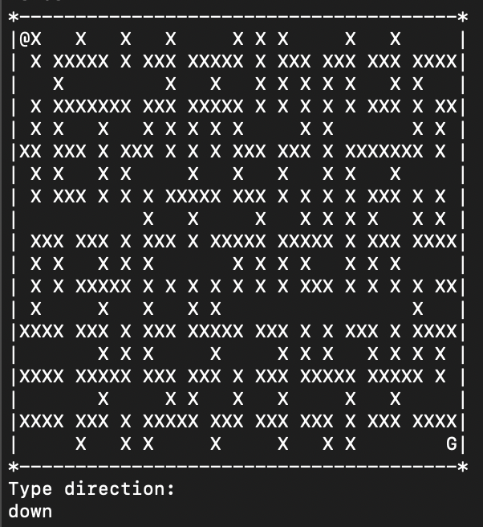

# Maze Game
## Introduction
Maze Game is a simple and interactive game that allows players to navigate through a maze! Simply type the direction in which you wish to move and avoid obstacles to reach the end. Players can either use the given maze template or load their own maze for further customization.

## Description of Equipment & List of Materials
To play Maze Game, you must have a computer with an environment that compiles and runs Java code. You can either use your preferred IDE or a terminal (described below).

For Mac users: use Terminal (pre-installed on all Macs)

Windows users: [install PuTTY](https://www.putty.org/).

To download Java, [go here for more information](https://java.com/en/download/help/download_options.html).

## Code example

## Installation instructions
1. Go to the [project's Github page](https://github.com/scolumbia/Maze).
2. Click the drop-down "Code" button and press "Download Zip."

3. Unzip the folder and place its contents in your working directory.
4. If you're using an IDE, follow its process for running code. Otherwise, continue with these instructions.
5. Pull up your terminal.
6. Navigate to your current working directory.
7. At the Bash prompt, type `ls` to see directory contents.

 If you do not see the expected files, revisit steps 1-3.
 
8. At the Bash prompt, type `javac MazeGame.java` to compile the code.

9. At the Bash prompt, type `java MazeGame` to run the code.

## Examples of the Maze code

## FAQs
- Q: What is my current position represented by?
  - A: The player's current position is represented by an @ symbol.
- Q: Where is the goal?
  - A: The "G" represents the goal.
- Q: How do I stop playing in the middle of a game?
  - A: Type "quit" at the enter direction prompt.
- Q: What are the dots on my screen?
  - A: When your sprite moves, they leave breadcrumbs in the spaces they've already visited. This prevents players from accidentally backtracking.
- Q: How do I move my sprite?
  - A: Type either "down", "up", "right", or "left."
- Q: What is the user interface?
  - A: For efficiency and ease of implementation, all game interaction is done via the console.
- Q: Why does the maze reprint whenever I'm prompted to make a move?
  - A: This is a simple game implementation. Each time the maze is updated, the new state is printed to the console.
- Q: How do I create a new maze layout?
  - A: To customize your own maze, simply edit the file "hard.txt." Keep the height and width the same. Openings are represented by 0's, and blocked squares are represented by 1's.

## Troubleshooting/ and Where to Get Support
If you find errors or encounter issues of any kind, email me at columbiase@appstate.edu.

## How to Contribute
Maze Game is a project based on a school assignment, so viewing the code is restricted for academic integrity reasons. Those who have completed CS 2440 at Appalachian State or will never take the course can email me at columbiase@appstate.edu to be granted access to the repository on Github. 

Contributions are welcomed! If you would like to contribute, please create a pull request by:
1. Creating a new branch, e.g. `git checkout branchname`
2. Committing changes from branch, e.g. `git commit -m "Message."`
3. Pushing branch to repository, e.g. `git push origin branchname` 
4. Opening a pull request on Github

## Licensing
All contents of this documentation belong to the author. Though the game code was written by the author, due credit is given to Appalachian State's Department of Computer Science for the creation of the lab that described the successful creation of a maze game. Unauthorized viewing of game code is stictly prohibited due to academic integrity policies.
